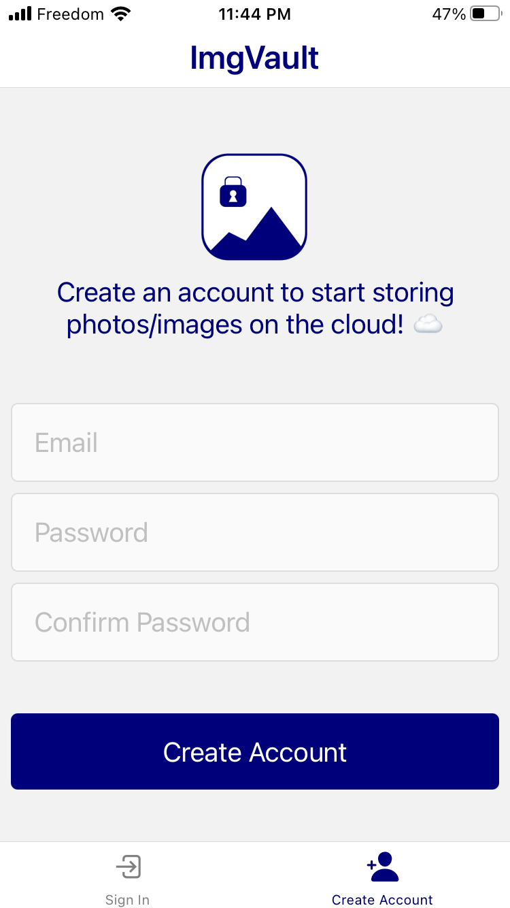
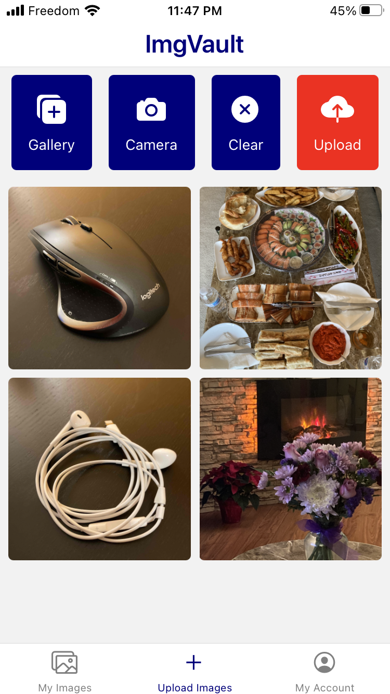
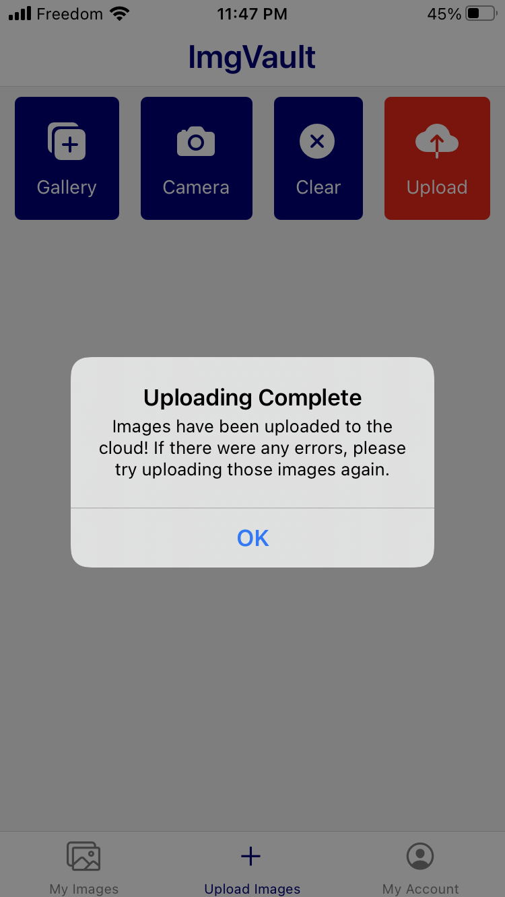
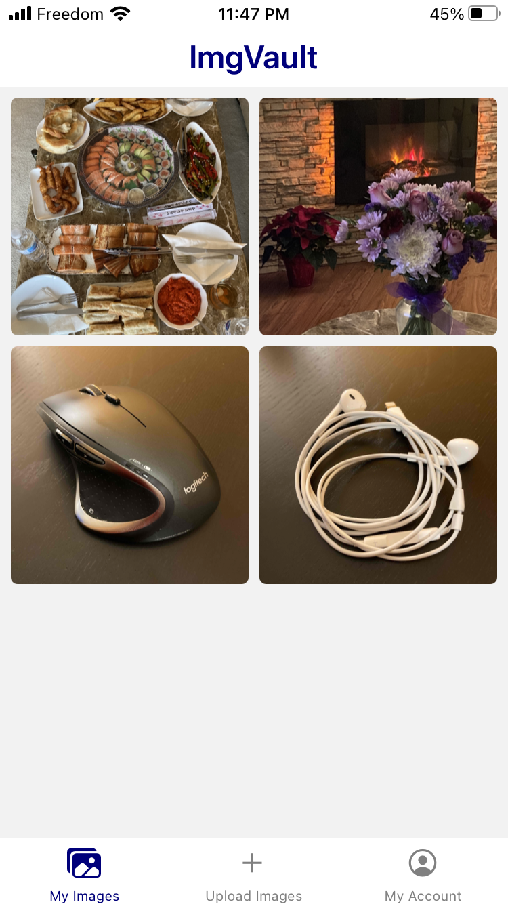
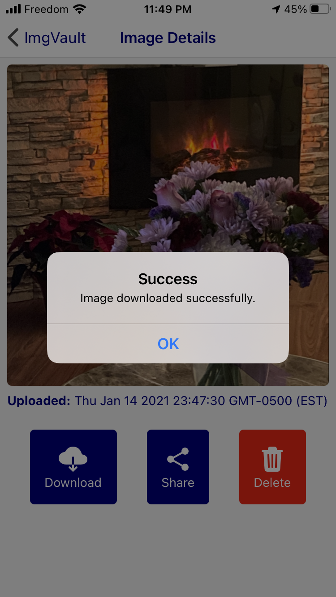
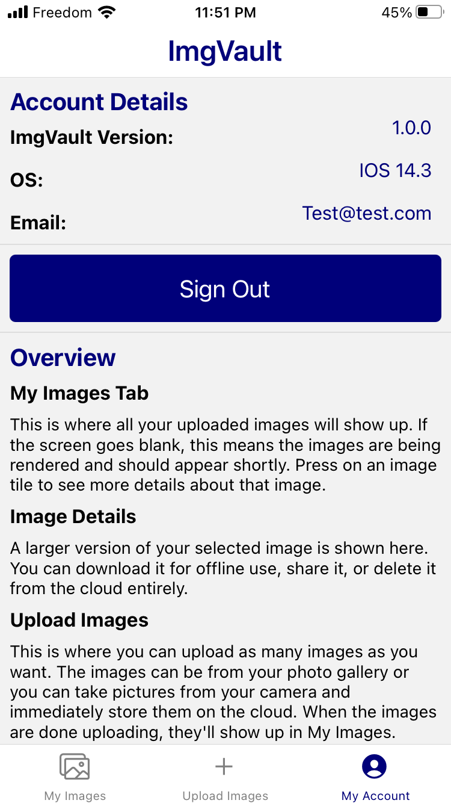
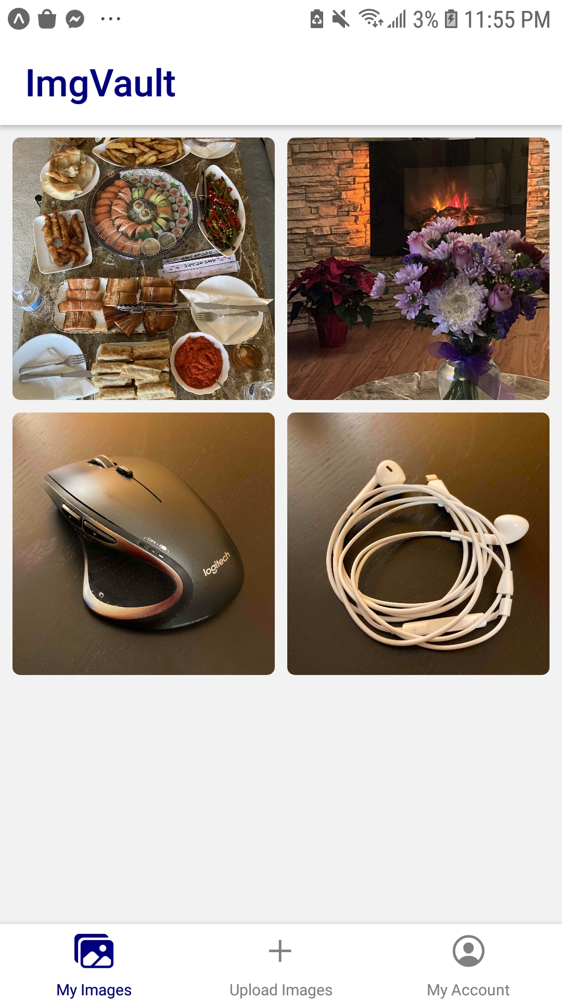
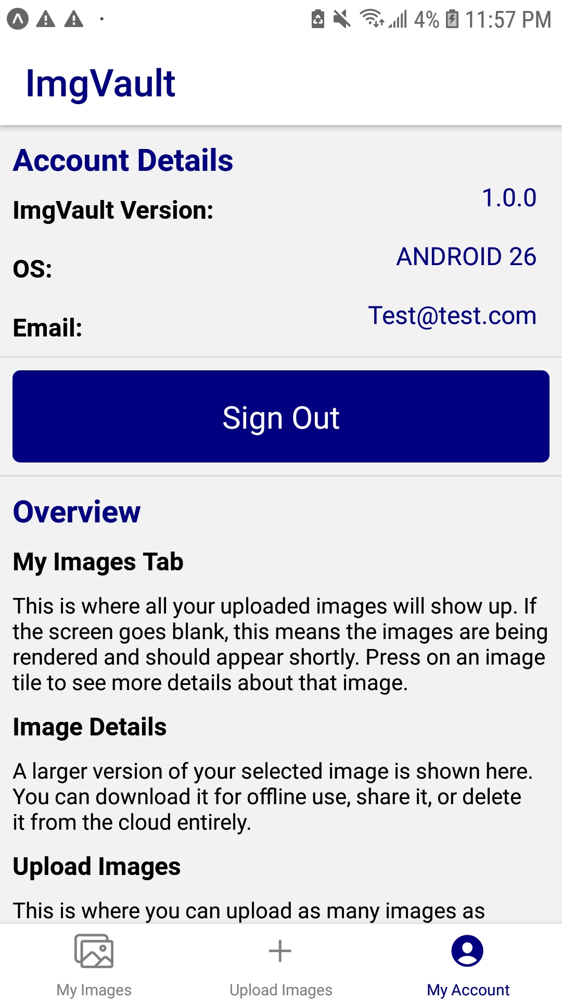
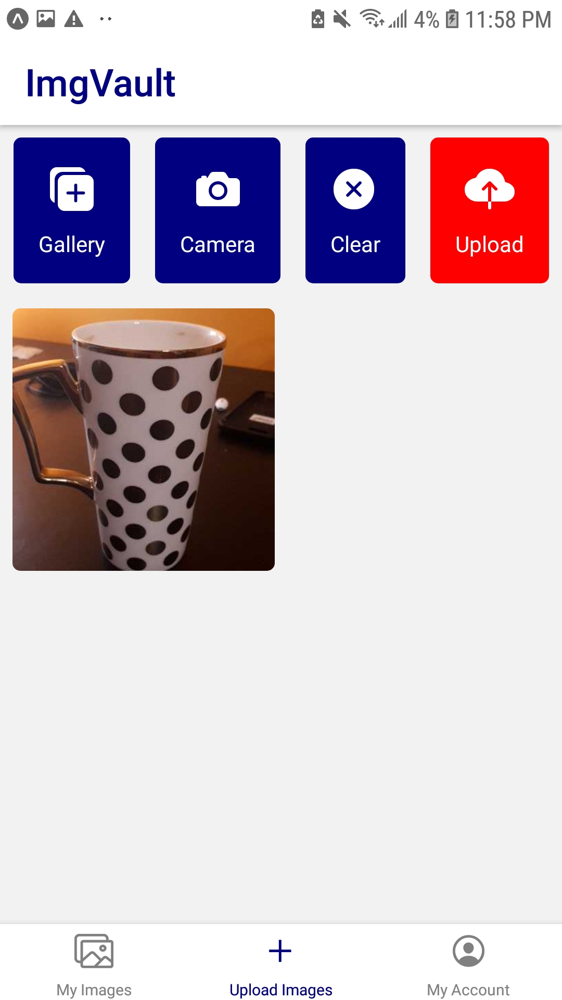

# My Submission For the Shopify Developer Intern Challenge

I present to you: **ImgVault**, an application that allows you to store your images on the cloud and save valuable space on your phone/computer. You can also share your images to your socials or other applications!

I wanted to challenge myself here and build a cross-platform application using React-Native and Expo, along with Firebase to store images and authenticate users. This application can be used on iOS, Android and the Web.

I'm super thankful for the opportunity, as I've definitely learned quite a lot from building this application!

## Why Did I Make This?

For my application to the *Backend Developer Intern* and the *Infrastructure / Site Reliability Engineering Intern* position at Shopify,
I was tasked to implement an image repository with minimal restrictions on what the solution could do.

For a more thorough explanation of the problem: [Problem Statement Documentation](https://docs.google.com/document/d/1ZKRywXQLZWOqVOHC4JkF3LqdpO3Llpfk_CkZPR8bjak/edit)

## Screenshots!

## Implementation
### Overview

I focused on implementing a few things in my application, including components of **ADD** and **DELETE** from the problem statement. Here's what I've implemented altogether.

#### Uploading
- Upload images from photo gallery on device to ImgVault (storing the images in Firebase)
- Take pictures from the camera and upload them immediately to ImgVault (storing the pictures in Firebase)
- Allow the user to upload many photos at one time.
- Allow the user to preview all images that they want to upload before the process kicks off.
- Allow the user to clear the images and choose other images that they wish to upload instead.

#### Viewing
- Allow the user to view their images that are stored on ImgVault. (Pulling this information from Firebase)
- Press on an image to view more details about an image, providing actions that the user can do with the image.
- View account details, providing simple info about the application, device, and ImgVault account.

#### Downloading
- Download an image from ImgVault when desired (Using the download url provided by Firebase to download the image and store the image in local storage)

#### Sharing
- Use built-in sharing features of the device to provide as much sharing options as possible, improving the sharing experience for the user.
- The images are private by default and are seen by no one but the user; sharing allows users to make these images public to whomever they wish.

#### Deleting
- Provide the user the ability to delete an image completely from ImgVault (Removing its instance entirely on Firebase)

#### Firebase
- Use Firebase Authentication to create and log users in securely
- Use Firebase Storage to store the images securely
- Use Firebase Firestore as the database to store user information and references to user's stored images in storage

#### User Experience
- Make sure the user is not confused with the state of the application
  - Provide spinners to indicate uploading or loading images
  - Provide alerts to signify the completion of processes
- Provide a clean and uncluttered UI so that user can quickly pick up on how the application works.
- Provide an overview of the application to allow user to refer to how the application works.

## Learning Experience

### Challenges

By going with Expo's Managed Workflow, I came across a few issues. Expo didn't:
- provide an interface to use the device's multi image picker
- provide access to the device's actual storage
  - The storage that Expo provides access to is hard to reach by any file viewers and images stored there will not be seen by the user
  - The workaround of adding images to the media library of the device always returned a rejected promise for iOS even if I had satisfied all requirements needed to add an image there. This is a bug on Expo's end.

I have comments in my code about these issues and my workarounds to these issues.

In theory, I could've ejected from a managed workflow and continued making the application with just react-native, and take advantage of being able to write native code when the need arises. In practice though, this would slow my laptop down tremendously when developing. Xcode itself was taking 10-15 minutes to open, and it was still slow when it was finally open. Adding other resource intensive applications like Android Studio, my browser, and phone simulators really made the laptop unusable. It did make my old MacBook Pro a fantastic heater though. Ultimately, time is of the essence, and this is a big project to undertake. I wanted to make sure that I could submit something on time that was polished and of quality.

### Positives

Expo is a great tool to use to simplify the cross-platform development process. It handles the set up for you, removing a lot of overhead, so you can focus on the application itself. Because of that, I was able to quickly iterate through solutions and get immediate feedback with hot reloading.

It's understandable for Expo to not cover all use cases. Cross-platform really broadens the amount of devices one has to develop for and some features are impossible to develop for all devices, you'll need to build it on a case by case basis.
